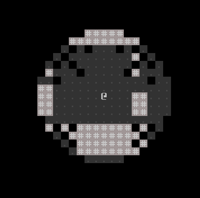

# Part 3 - Field of view

- [Reddit Post on /r/roguelikedev](https://old.reddit.com/r/roguelikedev/comments/hif9df/roguelikedev_does_the_complete_roguelike_tutorial/)
- [Original tutorial](http://rogueliketutorials.com/tutorials/tcod/v2/part-4/)

## Making tiles explorable

Until now, a `Tile` doesn't have any state - it's pretty much just a data class for a character and some colors
in my context, and that's how I want to keep it.  

So the place to add the _explored_ state, and of course, a second optional `Tile` is the `Entity` class.
```kotlin
class Entity(
    var position: Position3D,
    val type: EntityType,
    val tile: Tile,
    val tileHidden: Tile? = null,
    val isWalkable: Boolean = true,
    val isTransparent: Boolean = true,
    var isExplored: Boolean = false
)
```
The `Entity` class gets more and more cluttered here with stuff not every entity would need, 
which I will take care of in the next part of the tutorial, when there will be more than just terrain entities.

Mind this line: `val tileHidden: Tile? = null,` - the `?` next to a type means that this variable is _nullable_ and
will need some special treatment whenever it's used.

I also prefixed all booleans with an `is`.

## Creating a FOV

For the field of vision, I will just use a set of booleans, where `true` means visible and `false` means not visible,
there is no need for a _partially visible_ state at the edge of the FOV at the moment.

I could either create an fov overlay for the whole map, or a smaller one which is positioned relative to the player. I 
could even make it smaller by generating just a list of positions which are visible. This means - once again, I will
add something to the `Entity` class. It seems fitting that the FOV is part of at least the player entity.

```kotlin
val fieldOfVision: MutableList<Position3D>? = null
```

Again, this val is nullable. I also need to pass an initial value here, since `fieldOfVision` is a val, not a var,
which means is technically `final`.

```kotlin
    val player = Entity(
        position = Position3D.defaultPosition(),
        type = EntityType.ACTOR,
        tile = Tile.newBuilder()
            .withCharacter('@')
            .withBackgroundColor(TileColor.transparent())
            .withForegroundColor(TileColor.defaultForegroundColor())
            .build(),
        fieldOfVision = mutableListOf()
    )
```

This is how the player entity creation looks now.

To update the FOV, I added a `Action` class - `UpdateFovAction`, which is still empty right now. It is triggered after
every action the player takes.

## Calculating the FOV

I did a bit of digging around in the zircon library, and I found their implementation of a few Bresenham shape
algorithms, which is just what I need for the calculation.

First, I will need to create a circle containing all possible visible positions. Right now, the vision range of
the player is a radius of 11 units.
```kotlin
val fovCircle = EllipseFactory.buildEllipse(
    EllipseParameters(entity.position.to2DPosition(), Size.create(11,11)))
```

And for the actual calculation, I will cast a `Line` from the center to each available position inside the FOV circle:

```kotlin
val visiblePositions: MutableList<Position3D> = mutableListOf()
fovCircle.positions.forEach { fovPosition ->
    LineFactory.buildLine(center, fovPosition).positions
        .filterNot { visiblePositions.contains(it.to3DPosition(0)) }
        .takeWhile { linePosition ->
            !engine.entities.filter { it.position.to2DPosition() == linePosition }
                .any { !it.isTransparent }
        }
        .forEach { visiblePositions.add(it.to3DPosition(0)) }
}
```

This should bascially work I think.

## Hide and show the terrain

This time, I might need to actually modify the `WorldBlock` and set it to either visible or not visible. Adding a visible
state to the `Entity` class might not be fully sufficient here, since the fov is only updated once each turn, and would 
need some extra work if, for example, a NPC moves out of the FOV after the player's actions. So I just added 
`var isVisible = false` to `WorldBlock`

First, a small addition to the `World` class:
```kotlin
fun updateFov(visiblePositions: List<Position3D>) {
    blocks.forEach { (_, block) -> block.isVisible = false }
    visiblePositions.forEach { position ->
        blocks[position]?.isVisible = true
    }
}
```
The first line resets all blocks to an invisible state. The second one sets all blocks within the FOV to visible again.

To hide everything which is invisble I made a small change in `WorldBlock`s `tiles` and `emptyTile` getter:
```kotlin
override val emptyTile: Tile
    get() =
        when {
            !isVisible -> super.emptyTile
            entities.any { it.type == EntityType.TERRAIN } -> entities.first { it.type == EntityType.TERRAIN }.tile
            else -> super.emptyTile
        }

override var tiles: PersistentMap<BlockTileType, Tile>
    get() = persistentMapOf(
        Pair(
            BlockTileType.TOP, when {
                !isVisible -> emptyTile
                entities.isEmpty() -> emptyTile
                else -> entities.first().tile
            }
        )
    )
```
So, right now, only tiles which are inside the fov are shown - the `explored` part is completely ignored for now.

## Bugfixing

Technically, the FOV works. Practically, there are still some issues. First of all, walls are not shown correctly.
The fix for this problem isn't that much of an issue, just a redesign of the `UpdateFovAction`.

```kotlin
val visiblePositions: MutableList<Position3D> = mutableListOf()
fovCircle.positions.forEach { fovPosition ->
    for (linePosition in LineFactory.buildLine(center, fovPosition).positions) {
        visiblePositions.add(linePosition.to3DPosition(0))
        if (engine.entities.filter { it.position.to2DPosition() == linePosition }
                .any { !it.isTransparent }) {
            break
        }
    }
}
```

Now, I add the `visiblePosition` before the check for transparency - which means the first view-blocking tile will still
be added. Also, I dropped the part where I skip positions which are already inised the `visiblePosition` list. If I
skip any already visible position, the next available position would be added before a check for the visibility is done.

Secondly, I want to generate a FOV right after dungeon creation - right now the screen is black initially, before the
first input is being performed. For now, I will add both actions to the `render` method of the `Engine`- which is called 
to initially render all entities to the game area.

```kotlin
fun render() {
    entities.forEach {
        gameArea.fetchBlockAt(it.position).get().addEntity(it)
    }
    UpdateFovAction().perform(this, player)
    ApplyFovAction(gameArea).perform(this, player)
}
```  

Finally, one problem is left to address: The _invisible_ artifacts within the field of view. This is caused by the line 
casting in the FOV calculation - not every available position is hit by a line, so no fov check is done, either.



With the FOV check turned off, the artifacts get more visible. 

The solution might be a bit quirky, but at least this seems to work:
```kotlin
EllipseFactory.buildEllipse(
    fromPosition = center,
    toPosition = center.withRelative(Position.create(radius, radius))
).positions.plus(
    EllipseFactory.buildEllipse(
        fromPosition = center,
        toPosition = center.withRelative(Position.create(radius - 1, radius - 1))
    ).positions
).forEach { fovPosition ->
    for (linePosition in LineFactory.buildLine(center, fovPosition).positions) {
        visiblePositions.add(linePosition.to3DPosition(0))
        if (engine.entities.filter { it.position.to2DPosition() == linePosition }
                .any { !it.isTransparent }) {
            break
        }
    }
}
```
To force more lines to be cast, I add another set of positions for the check, which I get by creating a second
circle with a reduced radius. The downside is - the FOV check now takes considerably longer.

## Remember already explored tiles

To conclude this part of the tutorial, already explored tiles should stay visible. Or, to put it in the context
of my implementation - any `Entity` of the type `TERRAIN` which has been inside the FOV once will be set to `isExplored=true`,
and each `WorldBlock` which is outside the FOV but contains at least one `Entity` with the attribute `isExplored=true`
will be displayed.

Updating all visible entities is as simple as adding these lines to `ApplyFovAction`

```kotlin
engine.entities.filter {
    entity.fieldOfVision.contains(it.position) && it.type == EntityType.TERRAIN
}.forEach {
    it.isExplored = true
}
```

To display all tiles which were previously explored, a small modification to the `WorldBlock` is necessary

```kotlin
    private val exploredEmptyTile: Tile?
        get() = entities.firstOrNull { it.isExplored && it.type == EntityType.TERRAIN }?.tile

    override val emptyTile: Tile
        get() =
            when {
                !isVisible -> exploredEmptyTile ?: super.emptyTile
                entities.any { it.type == EntityType.TERRAIN } -> entities.first { it.type == EntityType.TERRAIN }.tile
                else -> super.emptyTile
            }
```

This operator `?:` is called the _elvis operator_. Basically, `exploredEmptyTile ?: super.emptyTile` is short for
`if(exploredEmptyTile == null) { exploredEmptyTile } else { super.emptyTile }`

To display the already explored, but not visible tiles, the attribute `tileHidden` of the `Entity` class 
(which I renamed to `tileExplored`) comes into play. 

Not much to add here - I added the two new tiles to the `TileBlueprint` object, and added them in the `EntityBlueprint`
to the corresponding entities. I also made the walls tiles a bit darker in general.