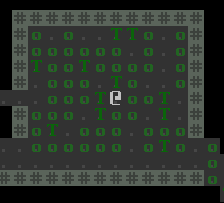

# Part 5 - Placing Enemies and kicking them (harmlessly)

- [Reddit Post on /r/roguelikedev](https://old.reddit.com/r/roguelikedev/comments/hif9df/roguelikedev_does_the_complete_roguelike_tutorial/)
- [Original tutorial](http://rogueliketutorials.com/tutorials/tcod/v2/part-5/)

## Taming the first monster

Before I continue with the tutorial, I will address a few problems which came up during the development. One is,
of course, the structure of the whole project, which is more spaghetti code than anything else so far. 

The input handler is just something function in a random place. Entities are getting more and more bloated. I don't
have a real event system. There is no one place which holds the game's information, and many more.

I can't change all of that at once, so I will start with the one which needs treatment most of all - the `Entity`. Right
now, the class already has 7 attributes, and the number will just be increasing in the future, so I will have to
split that up a bit. Also, again, I won't be adding an actual ECS here.

First, I will wrap every attribute an entity has in a `Component`, so that in the end the `Entity` isn't much
more than a `List<Component>`

I created a component for every (somewhat) logical group of attributes. I renamed a few things, so they will fit
better into the new structure. Also, the `EntityType` has been moved to  `tile.TileLayer`. The values are still
the same.
```kotlin
interface Component

data class Position(
    var position3D: Position3D = Position3D.defaultPosition()
) : Component

data class Tile(
    val tileVisible: Tile,
    val tileHidden: Tile
) : Component

data class MapAttributes(
    val isBlocking: Boolean = true,
    val isTransparent: Boolean = true,
    var isExplored: Boolean = false
) : Component

data class FieldOfView(
    val fieldOfVision: MutableList<Position3D> = mutableListOf()
) : Component
```

The `Component` interface is empty on intention - I just need it for grouping the components together. Further, as promised,
the `Entity` class has been reduced to a single list.

```kotlin
class Entity(
    val components : MutableList<Component>
)
```

At this point, I don't even dare to hit the _run_ button. 

The next step, and maybe the easiest, ist getting the `EntityBlueprint` object updated. This is how the 
`wall` blueprint looks now - the `floor` is very similar to this. And the `player` entity created in `main.kt` is
updated, too.

```kotlin
fun wallEntity(position: Position3D): Entity {
    return Entity(
        mutableListOf(
            Position(position),
            Tile(
                tileVisible = TileBlueprint.wall(),
                tileHidden = TileBlueprint.wallExplored()
            ),
            MapAttributes(
                isBlocking = true
            )
        )
    )
}
```

Before I can continue further, I need to implement a few more things. Right now, I have no way to access a specific
`Component` of an entity (or even check for its existence) in a somewhat convenient way. I need something which handles all
access and management of the entities.

With all of what I have created here before in mind, I can actually reduce the `Entity` itself to an `id`. This is
the _only_ thing all entities will have in common, maybe not now, but very soon. In my case, the `id` of an entity
will be a randomly generated `UUID` (which is also provided by zircon).

For a start, I created the class `EntityEngine` here, which should fulfil all the mentioned requirements.

```kotlin
class EntityEngine {
    private val componentStorage : MutableMap<KClass<Component>, MutableMap<UUID, Component>> = mutableMapOf()
}
```

All componets in the storage are mapped to their entity `UUID`, and all those mapped components of the same type 
are mapped to their corresponding type.

```kotlin
fun createEntity(): UUID {
    return UUID.randomUUID()
}

fun addComponent(entityId: UUID, component: Component) {
    getOrCreateComponentMap(component)[entityId] = component
}

fun addComponents(entityId: UUID, components: Set<Component>) {
    components.forEach {
        addComponent(entityId, it)
    }
}

private fun getOrCreateComponentMap(component: Component): MutableMap<UUID, Component> {
    return if (componentStorage[component::class] != null) {
        componentStorage[component::class]!!
    } else {
        val componentMap = mutableMapOf<UUID, Component>()
        componentStorage[component::class] = componentMap
        componentMap
    }
}
```

This is the first bunch of methods. On for creating a new entity (a random `UUID` here), and two for assigning
components to the entities. For easier access, I added a `EntityBuilder` class, and once again updated the 
`EntityBlueprint` object.

Next up, I will implement accessors to the components.
```kotlin
fun has(entityId: UUID, componentClass: KClass<out Component>): Boolean {
    return componentStorage[componentClass] != null && componentStorage[componentClass]?.containsKey(entityId)!!
}

@Suppress("UNCHECKED_CAST")
fun <T : Component> get(entityId: UUID, componentClass: KClass<T>) : T? {
    return componentStorage[componentClass]?.get(entityId) as T?
}
```
With these, I can access specific components of a single entity. I decided to keep the names short - since the only
_thing_ which could be queried are components anyways. There is no check planned if an entity _exists_, because
an entity without any components is useless.

To get all entities of a specific type, I added this method:
```kotlin
@Suppress("UNCHECKED_CAST")
fun <T : Component> get(componentClass: KClass<T>) : Map<UUID, T> {
    return componentStorage[componentClass] as Map<UUID, T>
}
```

There is still a lot left to fix, the game is far from being able to run or compile, and the class which will be
the biggest challenge to fix is `WorldBlock` - there is a lot of interaction with the entities, which is all broken
right now.

In the first step of fixing this, I have to pass a reference of `EntityEngine` all the way down from `main.kt` over
`World` to the `WorldBlock`. After that, I will change all affected properties and methods one by one, 
and the first change needs to be done here:
```kotlin
private val exploredEmptyTile: Tile?
    get() = entities.firstOrNull { it.isExplored && it.type == EntityType.TERRAIN }?.tileExplored
```

I changed it to this:

```kotlin
private val exploredEmptyTile: Tile?
    get() =
        entities.filter {
            entityEngine.get(it, GridTile::class)!!.layer == TileLayer.TERRAIN
        }.map {
            entityEngine.get(it, GridTile::class)!!.tileHidden
        }.firstOrNull()
```
For all entities which are positioned on this block, I check if they are set to the `TERRAIN` layer, and then
I simply pick the `tileHidden` of the first available entity. 

I _really_ hope there are enough `null` checks here. I was told kotlin is very safe regarding this, 
but as a professional Java developer, the fear of a `NullPointerException` haunts me day and night.

Onto the next property which needs a change:

```kotlin
override val emptyTile: Tile
    get() =
        when {
            !isVisible -> exploredEmptyTile ?: super.emptyTile
            entities.any { it.type == EntityType.TERRAIN } -> entities.first { it.type == EntityType.TERRAIN }.tile
            else -> super.emptyTile
        }
```

I turned it to this:
```kotlin
override val emptyTile: Tile
    get() =
        when {
            !isVisible -> exploredEmptyTile ?: super.emptyTile
            terrainLayerEntities.isNotEmpty() -> terrainLayerEntities.map {
                entityEngine.get(it, GridTile::class)!!.tileVisible
            }.first()
            else -> super.emptyTile
        }
```

Because access to all entities on the `TERRAIN` layer is used three times in total, I made a property out of it, too:

```kotlin
private val terrainLayerEntities: List<UUID>
    get() = entities.filter {
        entityEngine.has(it, GridTile::class)
                && entityEngine.get(it, GridTile::class)!!.layer == TileLayer.TERRAIN
    }
``` 

Of course, I did change `exploredEmptyTile` to use `terrainLayerEntities`, too

And the next one: 

```kotlin
override var tiles: PersistentMap<BlockTileType, Tile>
    get() = persistentMapOf(
        Pair(
            BlockTileType.TOP, when {
                !isVisible -> emptyTile
                entities.isEmpty() -> emptyTile
                else -> entities.first().tile
            }
        )
    )
    set(value) {}
```

Not too much of a change, here. I really hope this works as expected, and `filter` doesn't mess up the sorted list.

```kotlin
override var tiles: PersistentMap<BlockTileType, Tile>
    get() = persistentMapOf(
        Pair(
            BlockTileType.TOP, when {
                !isVisible || entities.isEmpty() -> emptyTile
                else -> entities.filter {
                    entityEngine.has(it, GridTile::class)
                }.map {
                    entityEngine.get(it, GridTile::class)!!.tileVisible
                }.first()
            }
        )
    )
    set(value) {}
```

Two more methods are still missing a change - `addEntity` and `removeEntity`. Because the change is pretty small
this time, I will just post the changed methods

```kotlin
fun addEntity(entity: UUID) {
    if(!entityEngine.has(entity, GridTile::class)) {
        return
    }
    entities.add(entity)
    entities.sortBy {
        entityEngine.get(it, GridTile::class)?.layer
    }
}

fun removeEntity(entity: UUID) {
    entities.remove(entity)
}
```

The one thing I added is the initial check if an entity has a `GridTile` component.

To this point, I still have no way of testing the changes I made, and there is still a lot to change, 
so I will continue with `Action` and all of its descendants.

`ApplyFovAction` was the first one I changed:
```kotlin
override fun perform(engine: Engine, entityId: UUID) {
    if (!engine.entityEngine.has(entityId, FieldOfView::class) ||
        !engine.entityEngine.has(entityId, GridPosition::class)
    ) {
        return
    }

    val entityPosition = engine.entityEngine.get(entityId, GridPosition::class)!!.position3D

    world.updateFov(engine.entityEngine.get(entityId, FieldOfView::class)!!.visible)
    engine.entityEngine.get(GridAttributes::class).filter { (entityId, _) ->
        engine.entityEngine.has(entityId, GridPosition::class) &&
                engine.entityEngine.get(entityId, GridPosition::class)!!.position3D == entityPosition
    }.forEach{
        (_, gridAttributes) ->
        gridAttributes.isExplored = true
    }
}
```

Still not very confident about the `entityEngine.get(GridAttributes::class)`. It might just not work as intended,
but then I will find a different solution - and if I have to typecast every single entry I will do.

This is the updated UpdateFovAction

```kotlin
override fun perform(engine: Engine, entityId: UUID) {
    if (!engine.entityEngine.has(entityId, FieldOfView::class) ||
        !engine.entityEngine.has(entityId, GridPosition::class)
    ) {
        return
    }
    
    val fovComponent = engine.entityEngine.get(entityId, FieldOfView::class)!!
    
    val gridAttributesEntities = engine.entityEngine.get(GridAttributes::class).filter { (entityId, _) ->
        engine.entityEngine.has(entityId, GridPosition::class)
    }
    
    
    val center = engine.entityEngine.get(entityId, GridPosition::class)!!.position2D
    val radius = 11
    
    val visiblePositions: MutableList<Position3D> = mutableListOf()
    
    EllipseFactory.buildEllipse(
        fromPosition = center,
        toPosition = center.withRelative(Position.create(radius, radius))
    ).positions.plus(
        EllipseFactory.buildEllipse(
            fromPosition = center,
            toPosition = center.withRelative(Position.create(radius - 1, radius - 1))
        ).positions
    ).forEach { fovPosition ->
        for (linePosition in LineFactory.buildLine(center, fovPosition).positions) {
            visiblePositions.add(linePosition.to3DPosition(0))
    
            if (gridAttributesEntities.filter { (entityId, _) ->
                    engine.entityEngine.get(entityId, GridPosition::class)!!.position2D == linePosition
                }.any { (_, gridAttributes) -> !gridAttributes.isTransparent }) {
                break
            }
        }
    }
    
    fovComponent.visible.clear()
    fovComponent.visible.addAll(visiblePositions)
}
```

And a few more changes in the `MovementAction`


```kotlin
override fun perform(engine: Engine, entityId: UUID) {
    if (!engine.entityEngine.has(entityId, GridPosition::class)) {
        return
    }

    val entityPosition = engine.entityEngine.get(entityId, GridPosition::class)
    val targetPosition = entityPosition!!.position3D.withRelativeX(dx).withRelativeY(dy)

    when {
        targetPosition.x !in 0 until engine.gameArea.actualSize.xLength
                || targetPosition.y !in 0 until engine.gameArea.actualSize.yLength
        -> println(
            "Can't move beyond the edge of the world"
        )
        engine.entityEngine.get(GridPosition::class).filter {
                (entityId, position) ->
            position.position3D == targetPosition && engine.entityEngine.has(entityId, GridAttributes::class)
        }.any {
            (entityId, _) ->
            engine.entityEngine.get(entityId, GridAttributes::class)!!.isBlocking
        } -> println("Walked into a wall. BONK!")
        else -> {
            engine.gameArea.fetchBlockAt(entityPosition.position3D).get().removeEntity(entityId)
            engine.gameArea.fetchBlockAt(targetPosition).get().addEntity(entityId)
            entityPosition.position3D = targetPosition
        }
    }
}
```

And the last class to change was the `DungeonGenerator`. I won't post that here, it's too much code.

As ist seems, the project compiles! 
But.
The map is filled with Wall tiles, and the FOV doesn't seem to work (because the walls don't block anything).

There were just a few minor issues with copy and pasting, the whole new entity stuff technically works.

## Handling performance issues

Technically, yes. Practically, on my notebook the performance is so bad it takes about 5 seconds to even 
generate the dungeon (which isn't really the problem, this only happens once every level), and about 2 seconds
to do a full FOV update (which _is_ a problem). The notebook is an older Thinkpad with not a _that_
good processor, but even on my main computer with a Ryzen 5 of last year's generation, it takes a lot of time.

Obviously, the problem is that for each and every action on any `Position` 4000 entities are queried, all the time.
One of those calls won't be a problem, but, for example, in the FOV calculation 4000 entities are queried for every 
single step of the ray cast. 

Yes, I knew right from the beginning that my _everything is an entity_ approach will bring up a lot of challenges
(and, to be frank, is possibly outright stupid). It's likely not a decision I would make if I would build a game
for the sake of building a game. It's was a _do the tutorial a bit different to learn some new stuff_ decision.

Storing that amount of data isn't really a problem - it takes about 200 megabytes of RAM, but this includes a
lot of other stuff too (mostly other stuff to be fair... storing a few thousand integers shouldn't even be in
the MB area - 4000 times 3 64 bit integers should vaguely be around 100 kB, with some additional JVM overhead of course ).

I could try to optimize the dungeon creation - for example, just not create an entity for a terrain feature which
will never be visible anyways. This would reduce the number of entities quite a lot - by around 1/4th to 1/3rd. 
But again, the _amount_ of entities isn't a problem, but the amount of queries is. 

The other thing which comes to my mind is scrapping the _everything is an entity_ style. This would work, but
it took already so much time to redo the entity stuff to what it is now I really don't want to do this. And I
want to stick to my bad decisions.

The final idea is to not iterate over thousands of entities which are _possibly_ on the desired position, but
to get all components for entities which I know to be on a specific position. And each `GameBlock` knows which
entities are present on its position. And the `World` has indexed all `GameBlock`s by their position. So
this seems to be a viable solution. I know this contradicts the statement _`World` will only be used for presentation_,
but I don't see any other way.

And just a small update in the `UpdateFovAction` already resulted in a huge performance increase.

```kotlin
//...
).forEach { fovPosition ->
    for (linePosition in LineFactory.buildLine(center, fovPosition).positions) {
        visiblePositions.add(linePosition.to3DPosition(0))

        val entitiesOnPosition = engine.gameArea.fetchBlockAt(linePosition.to3DPosition(0)).get().getEntityList()

        if (entitiesOnPosition.mapNotNull {
                engine.entityEngine.get(it, GridAttributes::class)
            }.any {
                !it.isTransparent
            }) {
            break
        }
    }
}
//...
```

It's still quite laggy, because I still have to make a similar change in the `ApplyFovAction` class, too.

```kotlin
visible.forEach { position ->
    val entitiesOnPosition = engine.gameArea.fetchBlockAt(position).get().getEntityList()
    entitiesOnPosition.mapNotNull { entityId ->
        engine.entityEngine.get(entityId, GridAttributes::class)
    }.forEach { gridAttributes ->
        gridAttributes.isExplored = true
    }
}
```

And with the same change made in `MovementAction`, the performance is fine again.


## Placing enemies

With the entity system rebuilt, and the performance issues handled, it's finally time to start with the tutorial again.
First of all, a new component is necessary.

```kotlin
data class Name(
    val name: String,
    val description: String = ""
) : Component
```

I also added a blueprint for both the `orc` and the `troll`, so now I can finally start placing them in
the dungeon.

To achieve that, I just have to upgrade the stuff which already exists, and make something similar
to the `SectionLayoutStrategy`. I will just call it `SpawnStrategy` I think.

I will spawn the entities directly - that I means I will both need the random number generator, and
the `EntityEngine`.

```kotlin
interface SpawnStrategy {
    fun spawn(rng: Random, entityEngine: EntityEngine, terrain: Map<Position, LayoutElement>)
}
```

For my `SimpleEnemies` Strategy I will pick a random available location in each `Section` and spawn
enemies just like the tutorial suggests.

But before that, to make everything easier, I will change the `Section` - from now on it will no longer be automatically
filled with `WALL` elements. To still be able to do that for the main level `Section`, I added the `AllWallsLAyout`

```kotlin
class AllWallsLayout : SectionLayoutStrategy {
    override fun generateTerrain(bounds: Rect): Map<Position, LayoutElement> {
        val terrain = mutableMapOf<Position, LayoutElement>()
        bounds.fetchPositions().forEach {
            terrain[it] = LayoutElement.WALL
        }
        return terrain;
    }
}
```

I also neede to upgrade the `mergeData` method of `Section` - which simply skipped all `WALL` tiles generated in
each `Section`. This wasn't practical anymore, since I needed to actively merge walls ontop of empty blocks with
the new `AllWallsLayout`

```kotlin
private fun mergeLayout(layout: Map<Position, LayoutElement>) {
    layout.filter { (position, _) -> bounds.containsPosition(position) }
        .forEach { (position, element) ->
            if (internalLayout[position] != FLOOR) {
                internalLayout[position] = element
            }
        }
}
```

I also did a bit of renaming, because I always think the term _data_ is simply too generic.

Onto the monster spawning now! First I need to determine the total number of monsters I want to spawn in each section.
This is just a random number from 0 to (including) the maximum number of monsters per room

```kotlin
val numberOfMonsters = rng.nextInt(maxMonsters+1)
```

Next, I need a list of all positions I can spawn an enemy to. The most simple way (= easiest to code, not necessaily the
most simple for the CPU to handle) I can imagine is this:

```kotlin
val availablePositions = layout.filterValues { layoutElement -> layoutElement == LayoutElement.FLOOR }.keys.toList()
```

Because `keys` would only return a `Set<Position>`, which is iterable, but has no `get` method to get one specific element
I needed to add `toList()` at the end, because a `List<Position>` has the access capabilities I need.

Next, a simple `for` loop which selects a random position an adds a monster on it.

```kotlin
for (i in 0 until numberOfMonsters) {
    val position = availablePositions[rng.nextInt(availablePositions.size)]
    MonsterBlueprint.orc(entityEngine, position.to3DPosition(0))
}
```

Technically, it's possible to add multiple monsters to the same position. The easiest way to fix that is to save all
occupied positions in a separate list, and check if the position is already occupied before adding a new monster.
Instead of the `for` loop I now need a `while` loop which checks against the number of occupied positions.

```kotlin
while(occupiedPositions.size < numberOfMonsters) {
    val position = availablePositions[rng.nextInt(availablePositions.size)]
    if(occupiedPositions.contains(position)) {
        continue;
    }
    MonsterBlueprint.orc(entityEngine, position.to3DPosition(0))
    occupiedPositions.add(position)
}
```

And to add random variation to the spawned monsters, I just need to change the line
`MonsterBlueprint.orc(entityEngine, position.to3DPosition(0))` into this:

```kotlin
if (rng.nextInt(10) > 7) {
    MonsterBlueprint.troll(entityEngine, position.to3DPosition(0))
} else {
    MonsterBlueprint.orc(entityEngine, position.to3DPosition(0))
}
```

One issue is left - theoretically, the number of available positions could be less than the number of monsters
which should be generated. This is _very_ theoretical with the current parameters, but if I increase the monster
limit it could really become an issue. At least there is an easy fix for that.

The complete `spawn` method now looks like this:
```kotlin
 override fun spawn(
        rng: Random,
        entityEngine: EntityEngine,
        layout: Map<Position, LayoutElement>
    ) {
        val availablePositions =
            layout.filterValues { layoutElement -> layoutElement == LayoutElement.FLOOR }.keys.toList()

        if(availablePositions.size > maxMonsters){
            maxMonsters = availablePositions.size
        }
        
        val numberOfMonsters = rng.nextInt(maxMonsters + 1)
        val occupiedPositions: MutableList<Position> = mutableListOf()

        while (occupiedPositions.size < numberOfMonsters) {
            val position = availablePositions[rng.nextInt(availablePositions.size)]
            if (occupiedPositions.contains(position)) {
                continue;
            }
            if (rng.nextInt(10) > 7) {
                MonsterBlueprint.troll(entityEngine, position.to3DPosition(0))
            } else {
                MonsterBlueprint.orc(entityEngine, position.to3DPosition(0))
            }
            occupiedPositions.add(position)
        }
    }
```

In order to use this I need to add a method to the `Section` classe, too. This also made a few smaller changes 
to the `Section` class necessary - `Random` and `EntityEngine` are now private members of the class. This change
also affects `SectionLayoutStrategy` - `Random` is now a mandatory parameter of `generate`. I won't list all 
the changes here now, there are too much small ones on too many places, so here is just the updated `Section`:

```kotlin
class Section(
    val bounds: Rect,
    private val rng: Random,
    private val entityEngine: EntityEngine
) {
    private val internalLayout: MutableMap<Position, LayoutElement> = HashMap()

    val layout: Map<Position, LayoutElement>
        get() = internalLayout

    init {
        bounds.fetchPositions().forEach {
            internalLayout[it] = WALL
        }
    }

    fun generateLayoutWith(strategy: SectionLayoutStrategy) = also {
        mergeLayout(strategy.generateTerrain(bounds, rng))
    }

    fun spawnWith(strategy: SpawnStrategy) = also {
        strategy.spawn(rng, entityEngine, layout)
    }

    fun mergeInto(targetSection: Section) = also {
        targetSection.merge(this)
    }

   // ...

}
```

I'm not 100% happy that I directly create entities for monsters at this point, because it breaks with the concept
of `Section` a bit, but for now I think it works. The other way would have been to just generate spawn points and 
generate entities later in the dungeon generator - just like I did it with the level layout itself. I might come back
to that later.

After the first test run I think I _might_ have created a little bug:



And all of this because of a little stupid mistake here:
```kotlin
if(availablePositions.size > maxMonsters){
    maxMonsters = availablePositions.size
}
```

Onto the next topic, now!

## Bumping into enemies

Technically, bumping into entities is already handled by the `GridAttributes` component, but on the more practical side,
I need to be able to distinguish between bumping into a wall (blocked movement), bumping into an enemy (attacking them),
and maybe bumping into other stuff, like a door (opening it).

I will add new components - `Terrain` and `Actor` - which do not have any data for now, just empty classes. Their 
main purpose is to make different things appear in the console when the player bumps into them. 

```kotlin
class Terrain : Component

class Actor : Component
```

I also added them to the matching blueprints, and to the player creation. Of course, these more-or-less _entity type_
components remove the necessity of the `tileLayer` which is defined in `GridTile`. I will also merge the
contents of `GridAttributes` into `GridTile`.

```kotlin
data class GridTile(
    val tileVisible: Tile,
    val tileHidden: Tile? = null,
    val isBlocking: Boolean = false,
    val isTransparent: Boolean = false,
    var isExplored: Boolean = false
) : Component
```

I bet you know already what that means - yes, exactly that! Changes pretty much everywhere which could possible break
everything!

The changes aren't to severe, though. Just a little change in the entity sorting of `WorldBlock`
```kotlin
entities.sortBy{
    entityId ->
    when {
        entityEngine.has(entityId, Actor::class) -> 1
        entityEngine.has(entityId, Terrain::class) -> 10
        else -> Int.MAX_VALUE
    }
}
```
Per default, this is sorted ascending, so the entity which comes on top should get the lowest number. Anything without
a specified order is sent right to the bottom.

I don't really consider this macig numbers, since the only meaning of the numbers is their numeric sorting value, therfor 
I don't use constants or an enum here (while I _could_ use the `TileLayer one, though)

The other bigger change in this class was this:
```kotlin
private val terrainLayerEntities: List<UUID>
        get() = entities.filter {
            entityEngine.has(it, GridTile::class)
                    && entityEngine.has(it, Terrain::class)
        }
```

